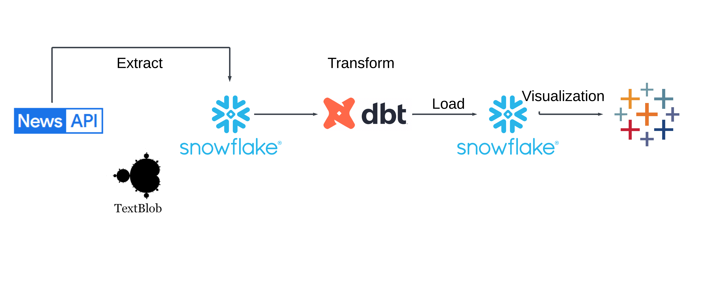
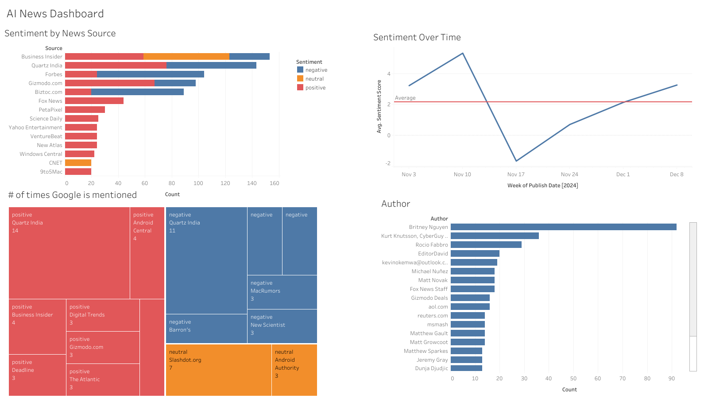

# News Article Pipeline and Analysis

This project leverages the News API to collect recent articles about artificial intelligence, utilizing TextBlob for natural language processing and sentiment analysis. By extracting and analyzing news content, the pipeline processes articles to determine sentiment trends in AI-related reporting. Snowflake serves as the data warehouse, providing robust storage and scalability for large volumes of news data, while dbt (data build tool) enables efficient data transformation and modeling. The workflow involves retrieving news articles, performing sentiment analysis to categorize them as positive, negative, or neutral, and creating structured datasets that can reveal insights into media perception and narrative trends surrounding artificial intelligence technologies.

## Architecture

## Project Setup and Installation

### Prerequisites
- Python 3.8+
- Snowflake account
- [News API key](https://newsapi.org/)

### Installation Steps
1. Clone the repository:
git clone https://github.com/arrismo/news-dashboard.git
cd news-dashboard

### Create Virtual Environment 
`python -m venv venv`
`source venv/bin/activate`  # On Windows, use `venv\Scripts\activate`

### Install dependencies
`pip install -r requirements.txt`

### Set up environment variables:

# Create a .env file in the project root
`touch .env`

# Add the following:
`NEWS_API_KEY=your_news_api_key` \
`SNOWFLAKE_ACCOUNT=your_snowflake_account` \
`SNOWFLAKE_USER=your_username` \
`SNOWFLAKE_PASSWORD=your_password` 

### Running the pipeline

Extract News Data \
`python tap_news.py`

Run dbt transformations \
### Configurations

Update `news_project/models/` for custom transformations

`dbt run`

Generate Setiment analysis \
`python sentiment_analysis.py`

Load to Snowflake \
`python target-snowflake.py`

# Tableau Dashboard

Key Components
1. Sentiment by News Source

    Description: A stacked bar chart showing the sentiment (positive, neutral, negative) of articles for each news source.
    Purpose: Understand which sources produce the most articles and their overall tone.
    Insights:
        "Business Insider" and "Quartz India" are leading contributors.
        Sentiment varies widely across sources, with most articles showing positive or negative sentiment.

2. Sentiment Over Time

    Description: A line chart tracking the average sentiment score of articles over a series of weeks. A red reference line marks the overall average sentiment.
    Purpose: Monitor how sentiment changes over time, detect trends, and highlight anomalies.
    Insights:
        A sharp drop in sentiment occurred around November 17, followed by gradual recovery.
        Sentiment peaked in early November and rose again in December.

3. Number of Times Google is Mentioned

    Description: A treemap visualizing the frequency of Google mentions in article titles, grouped by sentiment and news source.
    Purpose: Identify which sources highlight Google the most and assess the tone of coverage.
    Insights:
        "Quartz India" leads with the highest number of mentions, all positive.
        Other sources, such as "Business Insider" and "Android Central," also contribute positively.

4. Author Analysis

    Description: A horizontal bar chart displaying the top authors by article count.
    Purpose: Highlight the most prolific authors contributing to AI-related coverage.
    Insights:
        "Britney Nguyen" published the most articles, far exceeding other authors.
        Authors like "Kurt Knutsson" and "Rocio Fabbro" also contributed significantly.